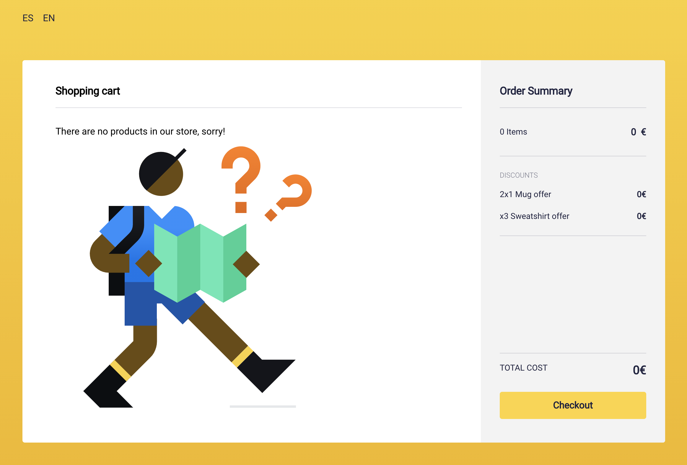
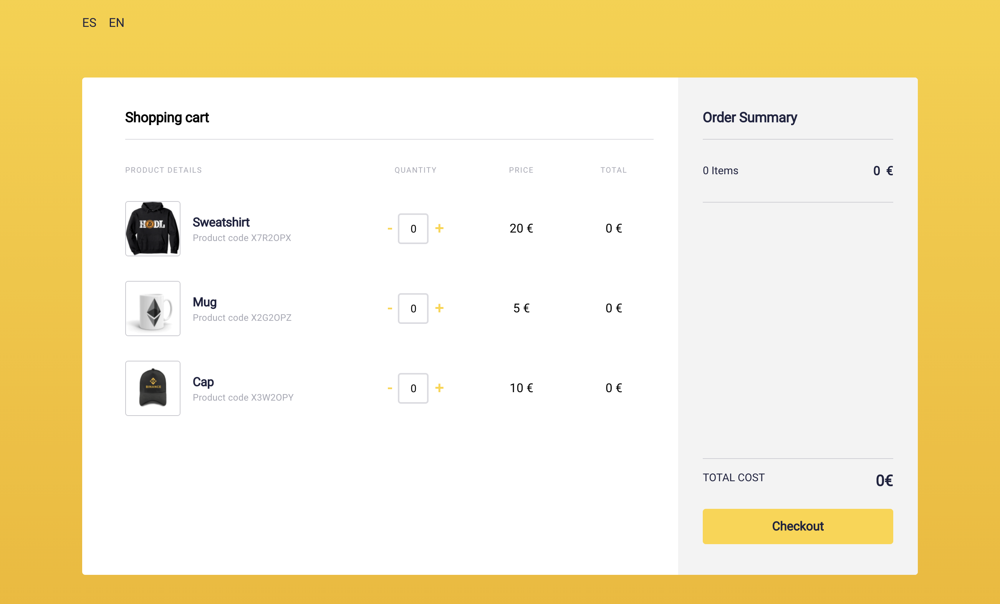
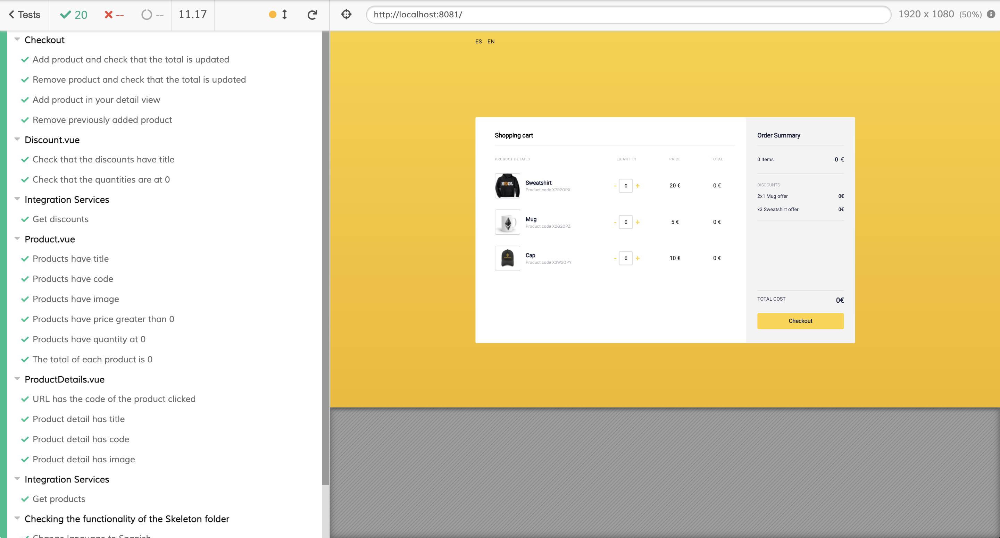

<div align="center">
  <h1>Shopping Cart</h1>
</div>

> A simple and easily scalable application to __sell products__ and __apply discounts__ in a physical store.

## [App](https://shopping-cart-cryptos.netlify.app/)
[](https://app.netlify.com/sites/shopping-cart-cryptos/deploys)

## Quick start

```bash
git clone git@github.com:cristianpoleyJS/shopping-cart.git
cd shopping-cart/
# Recommend use node v10
npm install
npm run serve
```

## Implementation

The class Checkout **can** be instantiated with available products and discounts: The Checkout parameters are what is available in the application (either products or discounts): If you don't pass products, a message will appear saying that there are no products available and if you don't pass discounts, it will not appear the Discount Box.
So what you pass to Checkout is what is available in the application.

All this is fed from the data coming from the API, you would only have to modify data in BBDD and the changes would be reflected directly (including discounts).

### Checkout without products

A Checkout can be initialized without products, so there would be no products available and a message would be displayed for this:

<div align="center">
    
</div>

### Checkout without discounts

A Checkout can be initialized without discounts, so there would be no discounts available:

<div align="center">
    
</div>

## Project code 👨‍💻

This project has been developed with **Vue 3** and **TypeScript**. I've been using Vue for years and I think it's a very flexible framework, with an easy learning curve and it's the one I have more experience with, that's why I chose it.

### Vuex

I use this library (although in this application it is not necessary, it is highly recommended for medium or bigger size applications), to show that I know the Flux architecture.

### Router

In this application there is no view except **the details of a product**. The main view starts with `Home.vue`. Clicking on the title of a product will direct you to a child path of this view, in this case `/<code-product>`. This view is rendered inside the Home.vue view with the `<router-view />` tag, in the component `ProductDetails.vue`. This component is **lazy-loaded**, this is defined in the `router/index.js` file.

in the `App.vue` file, we also have a `<router-view/>` tag to render all the paths of the application. It also has the `HeaderApp` component because this component would be common throughout the application.

### i18n.js && locales

If you want to add a new language, add a new json in the *locales* folder and import it into the *i18n.js* file. To change the language, you should add a new button in the application header (component *HeaderApp.vue*).

### vue.config.js

File to replace predefined Webpack settings.

## Run Tests 🧪

I have made some basic End-To-End tests. These tests are developed with Cypress.
To launch them is required to have installed [Google Chrome](https://support.google.com/chrome/answer/95346?co=GENIE.Platform%3DDesktop&hl=en).

```bash
npm run test
```

In the pop-up window that appears, manually select which Test you want to run or run all.
This must appear:

<div align="center">
    
</div>

## Deploy 🚀

The build generated by the project is hosted in a personal site of [Netlify](https://www.netlify.com/).

## Commitlint

This project follows the [commitlint](https://github.com/conventional-changelog/commitlint) guidelines, with minor changes.

## Author
[Website](https://cristianpoley.com)<br>
[GitHub](https://github.com/cristianpoleyJS)